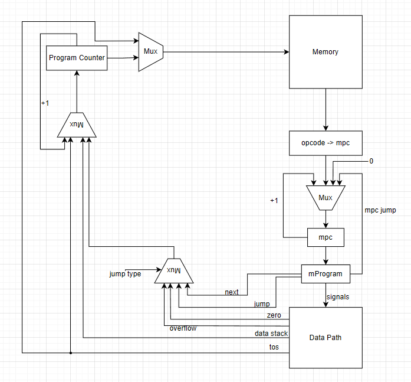
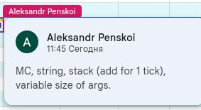

# csa-lab4
# Laboratory work № 4. Experiment
Амузинский Артем Андреевич, P3206
- Ваиант: `forth | stack | neum | mc | tick | binary | stream | port | pstr | prob1 | cache`
- Расшифровка варианта:
  - `forth`: forth-like stack-based syntax with Reverse Polish Notation (RPN)
  - `stack`: stack-based CPU architecture
  - `neum`: Von Neumann architecture
  - `mc`: microcoded control unit
  - `tick`: cycle-accurate simulation 
  - `binary`: true binary machine code
  - `stream`: stream based I/O
  - `port`: port-mapped I/O
  - `pstr`: Length-prefixed (Pascal string)
  - `prob1`: Find the largest palindrome made from the product of two 3-digit numbers.


## Схемы
https://drive.google.com/file/d/1yH4xpJZjwfba7quabQ0sjdoASbY9od4I/view?usp=sharing
```ebnf
<program> ::= <line>*

<line> ::= <label> <comment>? "\n"
        | <instr> <comment>? "\n"
        | <comment> "\n"

<label> ::= <label_name> ":"

<instr> ::= <op0>
         | <op1> " " <label_name>
         | <op1> " " <positive_integer>

<op0> ::= "drop"
       | "dup"
       | "swap"
       | "+"
       | "-"
       | "*"
       | "/"
       | "mod"
       | "negate"
       | "="
       | "<"
       | ">"
       | "and"
       | "or"
       | "xor"
       | "invert"
       | "if"
       | "!"
       | "@"
       | "halt"
       | "ret"
       | "c"

<op1> ::= "lit"
       | "call"
       | "jump"
       | "in"
       | "out"

<positive_integer> ::= [0-9]+

<lowercase_letter> ::= [a-z]
<uppercase_letter> ::= [A-Z]
<letter> ::= <lowercase_letter> | <uppercase_letter>
<digit> ::= [0-9]
<integer> ::= "-"? <digit>+

<letter_or_digit> ::= <letter> | <digit>
<letter_or_digit_or_underscore> ::= <letter_or_digit> | "_"

<label_name> ::= <letter> <letter_or_digit_or_underscore>*

<comment> ::= " "* ";" " "* <comment_text>?
<comment_text> ::= <letter_or_digit_or_underscore> ( " " <letter_or_digit_or_underscore> )*

```
## Организация памяти

Организация памяти:

* Вся внешняя память - статическая, SRAM
* Машинное слово – не определено. Реализуется высокоуровневой
  структурой данных. Операнд – 32-битный.
  Интерпретируется как знаковое целое число.
* Адресация – прямая абсолютная.
  Загрузка значения на вершину стека (`LIT`).
* Программа и данные хранятся в общей памяти согласно
  архитектуре Фон-Неймановского процессора.
  Программа состоит из
  набора инструкций, последняя инструкция – `HALT`.
  Процедуры размещаются в той же памяти, они обязаны завершаться при
  помощи инструкции `RET`.
* Операция записи в память перезапишет ячейку памяти как ячейку с данными.
  Программист имеет доступ на чтение/запись в
  любую ячейку памяти.
* Литералы - знаковые 32-разрядные числа. Константы отсутствуют.

Организация стека:

* Стек реализован в виде отдельного регистра, представляющего вершину
  стека (`TOS`) + массива.
* Стек 32-разрядный и позволяет полностью помещать один операнд одной ячейки памяти.

## Система команд

Особенности процессора:

* Машинное слово – не определено.
* Доступ к памяти осуществляется по адресу из специального регистра.
  Значение в нем может быть защелкнуто либо из PC, либо из вершины стека
* Обработка данных осуществляется в стеке. Данные попадают в стек из
  памяти, либо из устройств ввода/вывода.
* Поток управления:
  * Значение `PC` инкрементируется после исполнения каждой инструкции,
  * Условные (`if`) и безусловные (`jump`) переходы.

Набор инструкций:

`drop {element}` – Удаляет верхний элемент стека. <br>
`dup {element}` – Дублирует верхний элемент стека. <br>
`swap {e1, e2}` – Меняет местами два верхних элемента стека. <br>
`+ {e1, e2}` – Складывает два верхних элемента стека. <br>
`- {e1, e2}` – Вычитает верхний элемент из второго. <br>
`* {e1, e2}` – Умножает два верхних элемента. <br>
`/ {e1, e2}` – Делит второй элемент на верхний. <br>
`mod {e1, e2}` – Остаток от деления второго элемента на верхний. <br>
`negate {e1}` – Инвертирует знак верхнего элемента. <br>
`= {e1, e2}` – Проверяет равенство двух верхних элементов, кладет 1 (истина) или 0 (ложь).<br>
`< {e1, e2}` – Проверяет, меньше ли второй элемент, чем верхний.<br>
`> {e1, e2}` – Проверяет, больше ли второй элемент, чем верхний.<br>
`and {e1, e2}` – Побитовая операция И для двух верхних элементов.<br>
`or {e1, e2}` – Побитовая операция ИЛИ для двух верхних элементов.<br>
`xor {e1, e2}` – Побитовая операция Исключающее ИЛИ.<br>
`invert {e1}` – Инвертирует все биты верхнего элемента.<br>
`if {address}` – Условное выполнение: если верхний элемент стека не 0, выполняет код после if.<br>
`! {element, adress}` – Записывает значение во вторую ячейку памяти (store).<br>
`@ {adress}` – Читает значение из памяти (addr @).<br>
`in {port}` – Считывает один символ с клавиатуры и кладет его код в стек.<br>
`lit <literal>` – Загрузка литерала в вершину стека.<br>
`out {port}` – Загрузка вершины стека в буфер вывода.<br>
`jump {address}` – Переход на метку.<br>
`call {address}` – Вызов процедуры.<br>
`ret` – Возвращение из процедуры.<br>
`c` – Загрузить значение Carry-flag в стек.<br>
`halt` – остановка тактового генератора.<br>

## Транслятор
запуск:
```
translator.py input output.bin
input - входной файл с ассемблерным кодом
output.bin - бинарный файл, в который будет транслироваться код, так же
будет сделан output.bin.hex с мнемониками и 16-ричной трансляцией кода
```

Трансляция реализуется в два прохода:

1) Генерация машинного кода без подстановки переходов и расчет меток
   * 1.1. Парсинг исходного текста в термы (text2terms)
    Каждая строка разбивается на слова.
       Все слова проверяются:
        * если это метка (оканчивается на `:`), она сохраняется;
        * если это известный символ (операция или литерал), он сохраняется в список terms как объект Term(line, pos, symbol).
   * 1.2. Формирование таблицы меток (labels)
       * Первая итерация — подсчет количества инструкций до каждой метки (без учета самих меток).
       * Вторая итерация — назначение адреса (addr) каждой метке на основе смещения от начала.
       * В new_labels производится корректировка адресов, исключая те команды, у которых есть аргументы (lit, jump, call, if, in, out) — они занимают дополнительное место в памяти.
2) Генерация команд с подстановкой переходов
   * 2.1. Фильтрация термов
       * Метки удаляются из списка термов, так как они уже учтены в labels.
   * 2.2. Проход по термам и генерация кода
     * Обрабатываются инструкции по типу:
       * if, jump, call → заменяются на соответствующий Opcode, аргументом выступает адрес из new_labels. 
       * lit → после него ожидается число (десятичное или 0x-шестнадцатеричное), оно добавляется как аргумент. 
       * in, out → после них ожидается номер порта.
       * Остальные символы транслируются напрямую в машинные инструкции без аргументов (по symbol2opcode).
       * Каждая команда записывается как словарь с ключами: index, opcode, arg (если есть), term. 
   * 2.3. Добавление HALT
       * Если последняя команда не HALT, он добавляется автоматически.
3) Преобразование в машинный код
   * to_bytes
       Каждая инструкция переводится в байты:
        * 1 байт на opcode;
        * до 4 байт на аргумент (если он есть), причем код компактно кодирует аргумент (только нужное число байт, без лишних нулей).
        * Максимум — 5 байт на одну инструкцию.
4) Сохранение результатов
   * Исходный код читается из файла.
   * Переводится в список инструкций.
   * Генерируются два представления:
     * бинарное (.bin);
     * шестнадцатеричное (.hex).
   * Все сохраняется в указанный путь

## Модель процессора

запуск:
```
machine.py output.bin.hex input_stream [--quiet <without prints>]
output.bin.hex - входной файл с уже транслированным кодом
input_stream - поток ввода
--quiet - флаг для отключения вывода процессора
```

Описание реализации:

* Микропрограммное управление.
* Функция `process_next_command` переводит Opcode в микрокод
  и исполняет его потактово (каждый такт выполняется сигнал).
* Процесс моделирования – потактовый.
* Начало симуляции происходит в функции `simulation`.
  Процесс моделирования продолжается до исполнения инструкции `HALT`.
* Переполнения стека в данной модели не предусмотрено.
* Особенность реализации:
  реализован mpc, который позволяет избежать множественного дублирования микрокоманд, 
  например такое есть во всех операциях АЛУ. Микрокод на команду будет выполняться, пока меняется mpc.

Описание микрокода:

Микрокод представляет собой массив, в котором последовательно расположены микрокоманды,
каждая машинная команда может выполниться как за одну микрокоманду, так и за несколько,
выполнение микрокода будет продолжаться до тех пор, когда меняется переменная mpc (микропрограмм каунтер)
## Схемы DataPath и ControlUnit



## Запуск golden-тестов
```
(.venv) PS C:\Users\artem\PycharmProjects\csa-lab4> pytest
===================================================================================================== test session starts =====================================================================================================
platform win32 -- Python 3.11.8, pytest-8.3.5, pluggy-1.6.0
rootdir: C:\Users\artem\PycharmProjects\csa-lab4
configfile: pytest.ini
plugins: golden-0.2.2
collected 6 items                                                                                                                                                                                                              

golden_test.py ......                                                                                                                                                                                                    [100%]

====================================================================================================== 6 passed in 1.06s ====================================================================================================== 
```
работа тестов на github:
```
Run poetry run coverage run -m pytest
/home/runner/.cache/pypoetry/virtualenvs/forth-yJKRdTo1-py3.11/lib/python3.11/site-packages/pytest_golden/plugin.py:53: GoldenTestUsageWarning: Add 'enable_assertion_pass_hook=true' to pytest.ini for safer usage of pytest-golden.
  warnings.warn(
============================= test session starts ==============================
platform linux -- Python 3.11.12, pytest-7.4.4, pluggy-1.6.0
rootdir: /home/runner/work/csa-lab4/csa-lab4
configfile: pytest.ini
plugins: golden-0.2.2
collected 7 items

golden_test.py .......                                                   [100%]

============================== 7 passed in 2.65s ===============================
Run poetry run coverage report
Name             Stmts   Miss  Cover
------------------------------------
golden_test.py      53      0   100%
isa.py             113      8    93%
machine.py         396     61    85%
translator.py      118     13    89%
------------------------------------
TOTAL              680     82    88%
```

Для тестирования использовал все необходимые программы, а именно:
1) программа вывода Hello World!
2) программа hello_user
3) программа cat для вывода пользовательского ввода
4) программа arifm, которая отвечает за переполнение 32-битного регистра алу и сохранения этого числа в памяти
5) программа sort - сортировка массива, который ввел пользователь
6) программа prob1 для решения проблемы Эйлера