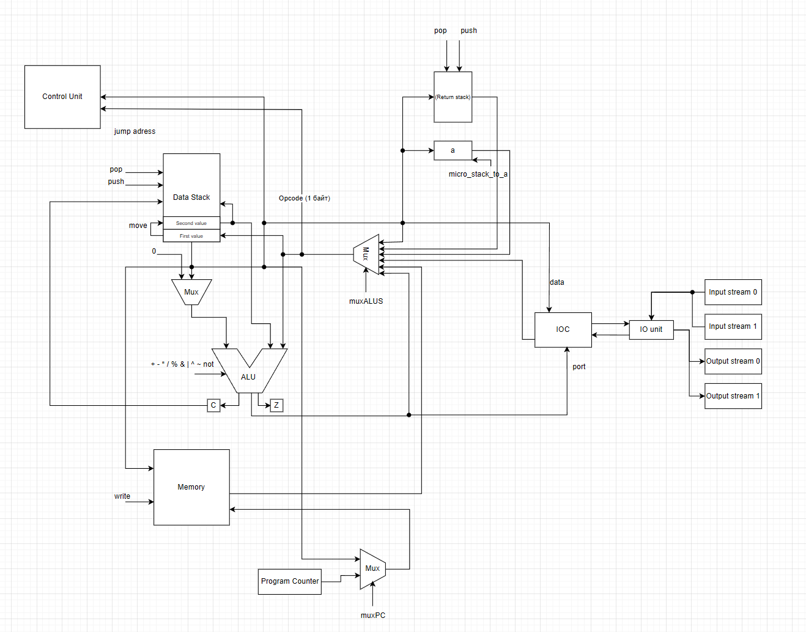

# csa-lab4
# Laboratory work № 4. Experiment
Амузинский Артем Андреевич, P3206
- Вариант: `forth | stack | neum | mc | tick | binary | stream | port | pstr | prob1 | cache`
- Расшифровка варианта:
  - `forth`: forth-like stack-based syntax with Reverse Polish Notation (RPN)
  - `stack`: stack-based CPU architecture
  - `neum`: Von Neumann architecture
  - `mc`: microcoded control unit
  - `tick`: cycle-accurate simulation 
  - `binary`: true binary machine code
  - `stream`: stream based I/O
  - `port`: port-mapped I/O
  - `pstr`: Length-prefixed (Pascal string)
  - `prob1`: Find the largest palindrome made from the product of two 3-digit numbers.


### Семантика
- Стратегия вычислений - стековая.
- Постфиксная запись (обратная польская нотация).
- Стек возврата — хранит адреса возврата для работы процедур и иногда хранит промежуточное значение, например для команды swap, но после выполнения команды возвращается в изначально значение.
- Сначала код полностью транслируется, потом последовательно выполняется.
- Область видимости: все переменные и все функции доступны везде.
- Термом S" <последовательность_символов>" объявляются строки, любое число определяется как знаковое. Строки, записанные не в указанном формате, трактуются как названия переменных или функций. Число может быть записано в десятичном или шестнадцатиричном формате.
- Код всегда будет начинать выполнение с метки `_start:`


```ebnf
<program> ::= <line>*

<line> ::= <label> <comment>? "\n"
        | <instr> <comment>? "\n"
        | <comment> "\n"

<label> ::= <label_name> ":"

<instr> ::= <op0>
         | <op1> " " <label_name>
         | <op1> " " <integer>
         | <op1> " " <variable>

<op0> ::= "drop"
       | "dup"
       | "swap"
       | "+"
       | "-"
       | "*"
       | "/"
       | "mod"
       | "negate"
       | "="
       | "<"
       | ">"
       | "and"
       | "or"
       | "xor"
       | "invert"
       | "if"
       | "!"
       | "@"
       | "halt"
       | "ret"
       | "c"

<op1> ::= "lit"
       | "call"
       | "jump"
       | "in"
       | "out"

<positive_integer> ::= [0-9]+

<lowercase_letter> ::= [a-z]
<uppercase_letter> ::= [A-Z]
<letter> ::= <lowercase_letter> | <uppercase_letter>
<digit> ::= [0-9]
<integer> ::= "-"? <digit>+
string ::= S" <любые символы>"
<letter_or_digit> ::= <letter> | <digit>
<letter_or_digit_or_underscore> ::= <letter_or_digit> | "_"

<label_name> ::= <letter> <letter_or_digit_or_underscore>*

<comment> ::= " "* ";" " "* <comment_text>?
<comment_text> ::= <letter_or_digit_or_underscore> ( " " <letter_or_digit_or_underscore> )*

```
## Организация памяти

Организация памяти:

* Вся внешняя память - статическая, SRAM
* Адресация – прямая абсолютная.
  Загрузка значения на вершину стека (`LIT`).
* Программа и данные хранятся в общей памяти согласно
  архитектуре Фон-Неймановского процессора.
  Программа состоит из
  набора инструкций, последняя инструкция – `HALT`.
  Процедуры размещаются в той же памяти, они обязаны завершаться при
  помощи инструкции `RET`.
* Операция записи в память перезапишет ячейку памяти как ячейку с данными.
  Программист имеет доступ на чтение/запись в
  любую ячейку памяти.

Организация стека:

* Стек реализован в виде отдельной структуры память, представляющего собой массив, у которого можно использовать только первое и второе значение.
* Стек 32-разрядный и позволяет полностью помещать один операнд в одну ячейку памяти.

## Система команд

Особенности процессора:
* Доступ к памяти осуществляется по адресу из специального регистра.
  Значение в нем может быть защелкнуто либо из PC, либо из вершины стека
* Обработка данных осуществляется в стеке. Данные попадают в стек из
  памяти, либо из устройств ввода/вывода.
* Поток управления:
  * Значение `PC` инкрементируется после исполнения каждой инструкции,
  * Условные (`if`) и безусловные (`jump`) переходы.

Набор инструкций:

`drop` – Удаляет верхний элемент стека. <br>
`dup` – Дублирует верхний элемент стека. <br>
`swap` – Меняет местами два верхних элемента стека. <br>
`+` – Складывает два верхних элемента стека. <br>
`-` – Вычитает верхний элемент из второго. <br>
`*` – Умножает два верхних элемента. <br>
`/` – Делит второй элемент на верхний. <br>
`mod` – Остаток от деления второго элемента на верхний. <br>
`negate` – Инвертирует знак верхнего элемента. <br>
`=` – Проверяет равенство двух верхних элементов, кладет 1 (истина) или 0 (ложь).<br>
`<` – Проверяет, меньше ли второй элемент, чем верхний.<br>
`>` – Проверяет, больше ли второй элемент, чем верхний.<br>
`and` – Побитовая операция И для двух верхних элементов.<br>
`or` – Побитовая операция ИЛИ для двух верхних элементов.<br>
`xor` – Побитовая операция Исключающее ИЛИ.<br>
`invert` – Инвертирует все биты верхнего элемента.<br>
`if {address}` – Условное выполнение: если верхний элемент стека не 0, выполняет код после if.<br>
`!` – Записывает значение во вторую ячейку памяти (store).<br>
`@` – Читает значение из памяти (addr @).<br>
`in {port}` – Считывает один символ с клавиатуры и кладет его код в стек.<br>
`lit <literal>` – Загрузка литерала в вершину стека.<br>
`out {port}` – Загрузка вершины стека в буфер вывода.<br>
`jump {address}` – Переход на метку.<br>
`call {address}` – Вызов процедуры.<br>
`ret` – Возвращение из процедуры.<br>
`c` – Загрузить значение Carry-flag в стек.<br>
`halt` – остановка тактового генератора.<br>

## Транслятор
запуск:
```
translator.py input output.bin
input - входной файл с ассемблерным кодом
output.bin - бинарный файл, в который будет транслироваться код, так же
будет сделан output.bin.hex с мнемониками и 16-ричной трансляцией кода
```

Трансляция реализуется в два прохода:

1) Первый проход — генерация машинного кода без подстановки переходов и расчёт меток
    * 1.1 Парсинг исходного текста в термы (text_to_terms)
        * Исходный текст разбивается на строки, каждая строка — на слова.
    * Каждое слово анализируется:
        * Если это метка (оканчивается на `:`), она сохраняется отдельно.
        * Если это известный символ (операция, литерал, имя переменной), он сохраняется как Term(line, pos, symbol).

    * 1.2 Формирование таблицы меток (labels)
        * Итерация 1: считаем количество инструкций до каждой метки (метки не входят в подсчёт).
        * Итерация 2: присваиваем каждой метке её смещённый адрес.

    * В new_labels производится корректировка адресов с учётом инструкций с аргументами (lit, jump, call, if, in, out), которые занимают дополнительное место в памяти (4 байта вместо 1–2).
2) Второй проход — генерация команд с подстановкой адресов переходов
   * 2.1 Фильтрация термов
        * Метки удаляются из списка термов: они уже обработаны и присутствуют в labels.
   * 2.2 Генерация инструкций
        * По каждому Term строится инструкция:
          * if, jump, call: преобразуются в соответствующий Opcode, аргументом становится адрес из new_labels.
          * lit: за ним ожидается число (десятичное или шестнадцатеричное 0x...), сохраняется как аргумент.
          * in, out: за ними указывается номер порта.
        * Остальные команды: трансляция без аргумента, ищется соответствующий Opcode в symbol_to_opcode.
3) Преобразование в машинный код
   * to_bytes
       Каждая инструкция переводится в байты:
        * 1 байт на opcode;
        * 3 байта на аргумент (если он есть).
4) Сохранение результатов
   * Исходный код читается из файла.
   * Переводится в список инструкций.
   * Генерируются два представления:
     * бинарное (.bin);
     * шестнадцатеричное (.hex).
   * Все сохраняется в указанный путь

## Модель процессора

запуск:
```
machine.py output.bin input_stream [--quiet <without prints>]
output.bin - входной файл с уже транслированным бинарным кодом
input_stream - поток ввода
--quiet - флаг для отключения вывода процессора
```


Описание реализации:

* Микропрограммное управление.
* Функция `process_next_command` переводит Opcode в микрокод
  и исполняет его потактово (каждый такт выполняется сигнал).
* Процесс моделирования – потактовый.
* Начало симуляции происходит в функции `simulation`.
  Процесс моделирования продолжается до исполнения инструкции `HALT`.
* Переполнения стека в данной модели не предусмотрено.
* Особенность реализации:
  реализован mpc, который позволяет избежать множественного дублирования микрокоманд, 
  например такое есть во всех операциях АЛУ. Микрокод на команду будет выполняться, пока меняется mpc.

Описание микрокода:

Микрокод представляет собой массив, в котором последовательно расположены микрокоманды,
каждая машинная команда может выполниться как за одну микрокоманду, так и за несколько,
выполнение микрокода будет продолжаться до тех пор, когда меняется переменная mpc (микропрограмм каунтер)
## Схемы DataPath и ControlUnit
Control Unit:


Data Path:




## Пример программы Hello world на моем языке
```
S" Hello, world!" VARIABLE hello_world  ; переменная со строкой
0x0 VARIABLE index                      ; переменная с индексом строки
0x0 VARIABLE len                        ; переменная с длиной строки (тк паскаль строки)
_start:
    lit len
    lit hello_world @
    !                                   ; сохраняем в переменную len длину паскаль строки
    lit index
    lit hello_world
    lit 4
    +
    !                                   ; сохраняем индекс первой буквы
while:
    lit index @ @                       ; загружаем первую букву и выводим ее
    out 2
    lit index
    dup
    @
    lit 4
    +                                   ; переходим на индекс следующей буквы
    !
    lit 1
    lit len @                           ; уменьшаем и сохраняем счетчик длины
    -
    dup
    if end                              ; проверяем счетчик длины на 0, если да, то переходим на метку end, если нет, то продолжаем выводить буквы
    lit len
    swap
    !
    jump while                          ; продолжаем цикл
end:                                    ; завершаем работу программы
    halt
```

## Запуск golden-тестов
```
(.venv) ~\PycharmProjects\csa-lab4 git:[main]
pytest 
C:\Users\artem\PycharmProjects\csa-lab4\.venv\Lib\site-packages\pytest_golden\plugin.py:53: GoldenTestUsageWarning: Add 'enable_assertion_pass_hook=true' to pytest.ini for safer usage of pytest-golden.
  warnings.warn(
==================================================================================================== test session starts ====================================================================================================
platform win32 -- Python 3.11.8, pytest-8.3.5, pluggy-1.6.0
rootdir: C:\Users\artem\PycharmProjects\csa-lab4
configfile: pytest.ini
plugins: anyio-4.9.0, golden-0.2.2
collected 7 items                                                                                                                                                                                                            

golden_test.py .......                                                                                                                                                                                                 [100%]

===================================================================================================== 7 passed in 1.24s =====================================================================================================```
```
работа тестов на github:

```
Run poetry run coverage run -m pytest
/home/runner/.cache/pypoetry/virtualenvs/forth-yJKRdTo1-py3.11/lib/python3.11/site-packages/pytest_golden/plugin.py:53: GoldenTestUsageWarning: Add 'enable_assertion_pass_hook=true' to pytest.ini for safer usage of pytest-golden.
  warnings.warn(
============================= test session starts ==============================
platform linux -- Python 3.11.12, pytest-7.4.4, pluggy-1.6.0
rootdir: /home/runner/work/csa-lab4/csa-lab4
configfile: pytest.ini
plugins: golden-0.2.2
collected 7 items

golden_test.py .......                                                   [100%]

============================== 7 passed in 2.65s ===============================
Run poetry run coverage report
Name             Stmts   Miss  Cover
------------------------------------
golden_test.py      53      0   100%
isa.py             113      8    93%
machine.py         396     61    85%
translator.py      118     13    89%
------------------------------------
TOTAL              680     82    88%
```

Для тестирования использовал все необходимые программы, а именно:
1) программа вывода Hello World! 
2) программа hello_user - [golden/hello_user_name0.yml](golden/hello_user_name0.yml) (для вопроса про имя), [golden/hello_user_name1.yml](golden/hello_user_name1.yml) (для приветствия пользователя)
3) программа cat для вывода пользовательского ввода - [golden/cat.yml](golden/cat.yml)
4) программа arifm, которая отвечает за переполнение 32-битного регистра алу и сохранения этого числа в памяти - [golden/carry_check.yml](golden/carry_check.yml)
5) программа sort - сортировка массива, который ввел пользователь - [golden/sort.yml](golden/sort.yml)
6) программа prob1 для решения проблемы Эйлера - [golden/prob.yml](golden/prob.yml)

